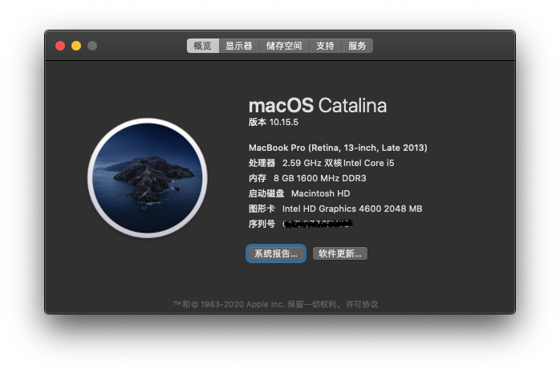
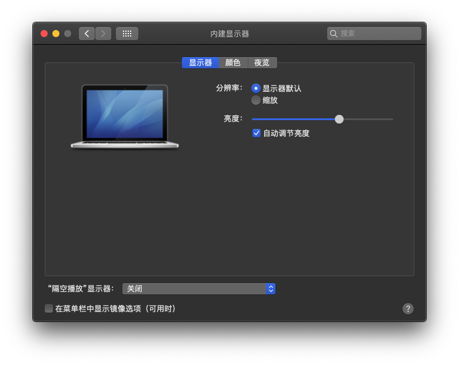
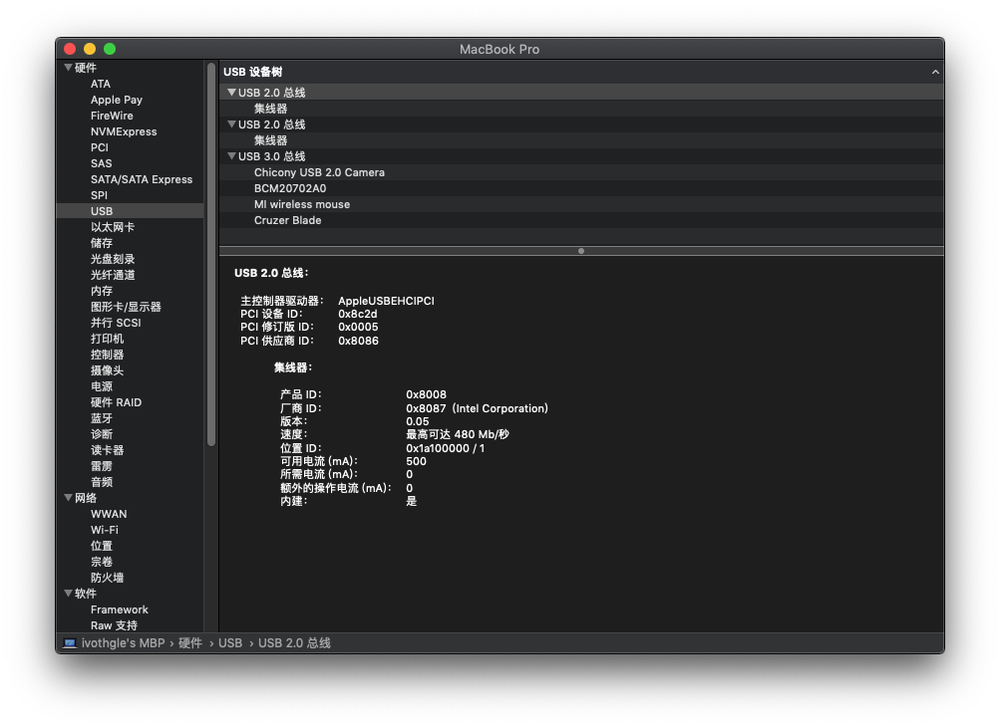
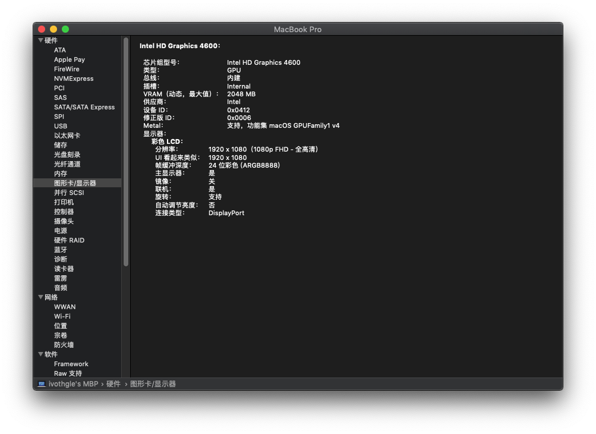
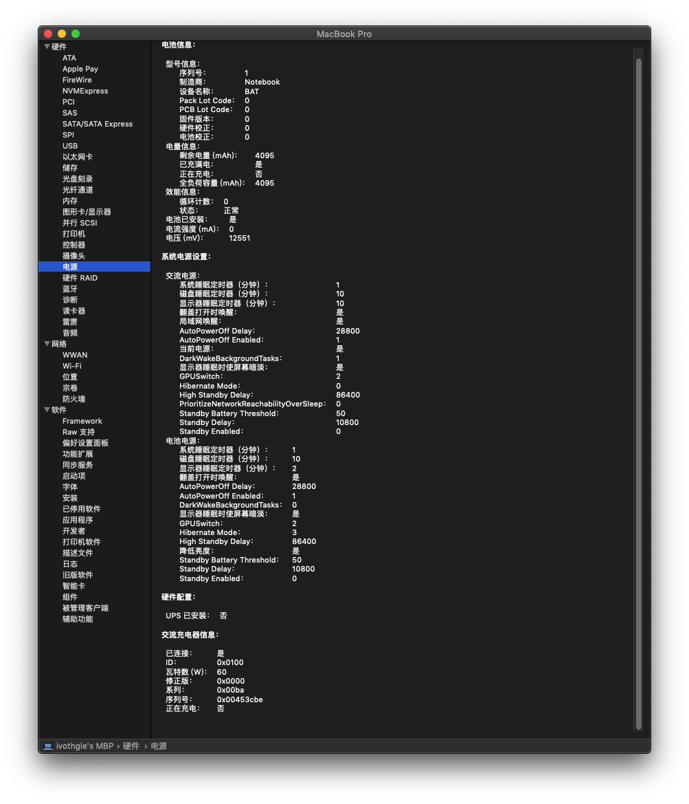
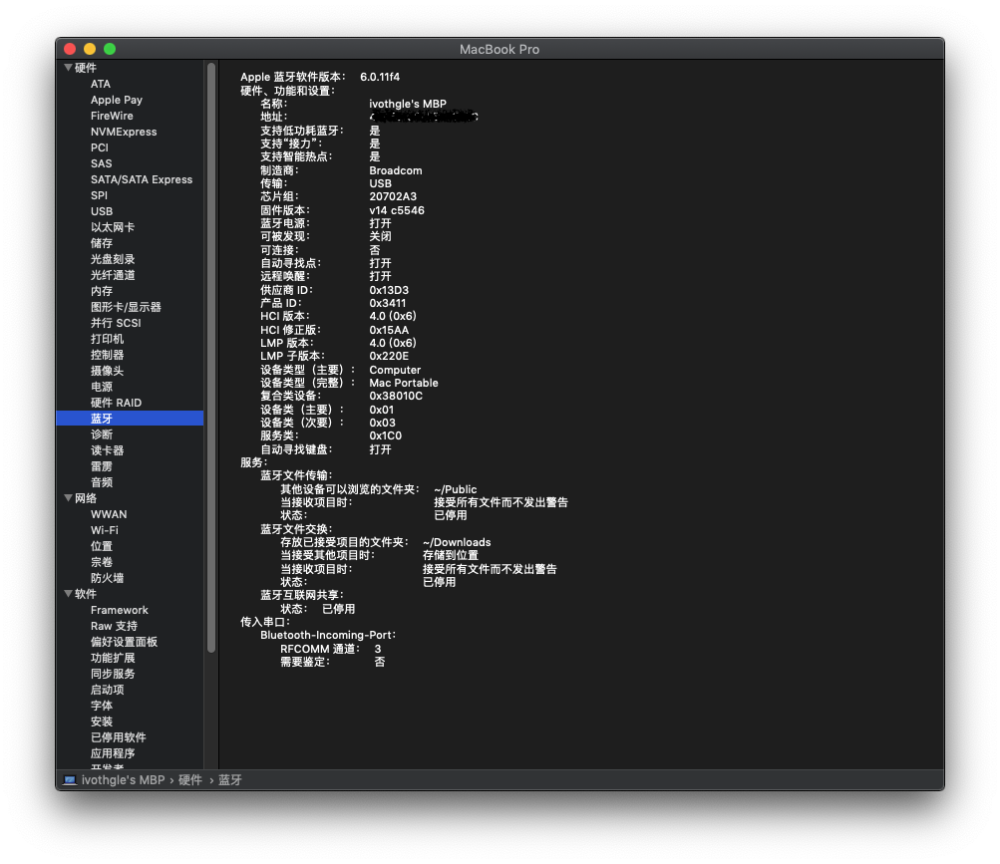
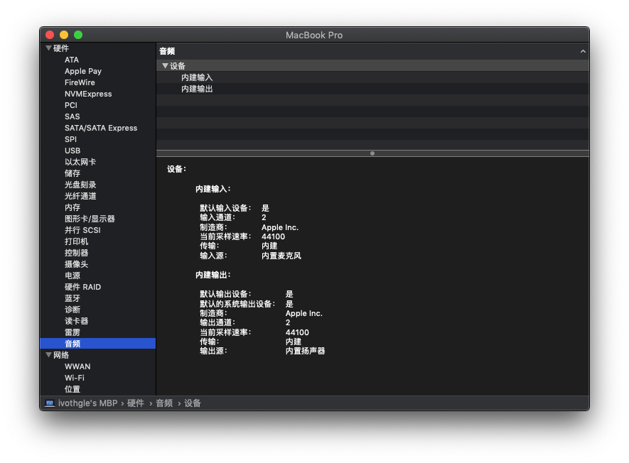
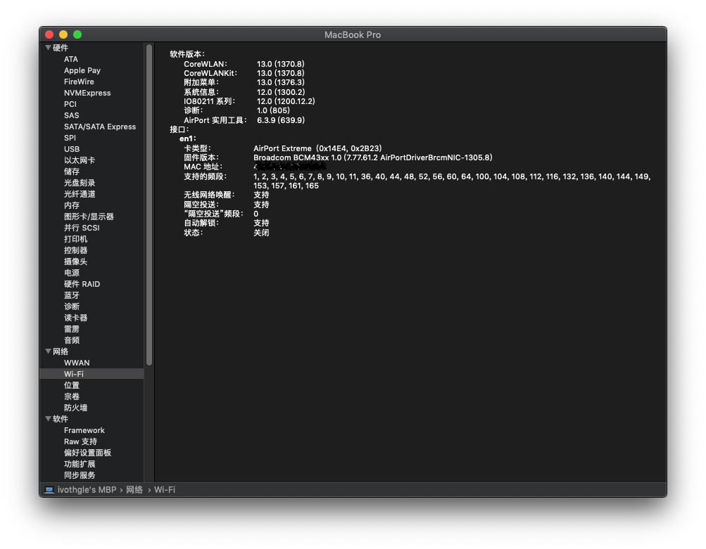

# Hasee K650D-i5 D2

## 电脑配置

| 规格     | 详细信息                           |
| -------- | ---------------------------------- |
| 电脑型号 | 战神 K650D-i5 D2                   |
| 处理器   | Intel Core i5-4210M @ 2.60GHz 双核 |
| 显卡     | Intel HD Graphics 4600             |
| 显示器   | 三星 1920x1080 (15.6 英寸)         |
| 声卡     | VIA VT10802 (节点:3/33/65)            |
| 网卡     | 英特尔网卡已更换为 BCM95352HMB     |
| 蓝牙     | 使用 BCM95352HMB                   |

## 正常工作的

- 显卡 显示器内建、亮度调节（可用 `Fn + F8` 和 `Fn + F9` 调节 ）
- 音频
- USB
- 有线、Wifi
- 蓝牙
- 睡眠（鼠标、电源键唤醒正常）
- 电池显示
- 变频（看起来没什么问题）

## 不能工作的

- 独显（无解，已屏蔽）
- 触摸板~~（对我没什么用，就没驱动）~~ [驱动方法戳我](other/TouchPad/README.md)

## 截图

## 其它

`BCM95352HMB` 处理，蓝牙需要屏蔽 51 针脚才能驱动，Wifi 如遇睡眠唤醒后无法打开，屏蔽 20 针脚。使用其它网卡的可用自行调整。

> 相关文档
> 
> | Pin No. | Definition     | Basic Description                  | Type  |
> | ------- | -------------- | ---------------------------------- | ----- |
> | 20      | WLAN_DISABLE_L | WLAN disable control (Active low). | Input |
> | 51      | BT_DISABLE_L   | BT disable control (Active low).   | Input |
>
> [查看针脚位置图片](https://www.tenforums.com/network-sharing/115932-intel-ac-7260-wi-fi-pci-e-asus-g73sw-laptop-win10-pro-64-no-go-2.html#post1438095)

## 更新

更新 修复 USB 稳定性，电池显示，注入 PCI 属性

改用 [headkaze/OS-X-BrcmPatchRAM](https://github.com/headkaze/OS-X-BrcmPatchRAM) 驱动蓝牙和提高 WIFI 稳定性

屏蔽独显和亮度键修复使用 hotpatch 补丁， 如使用 `ApplePS2SmartTouchPad.kext` 驱动的话可能导致亮度键无效。

更新 `AppleALC.kext` 到 `1.3.8` 后，可使用 layout-id 65。

## 鸣谢

- [黑果小兵](https://github.com/daliansky/) 
- [RehabMan](https://github.com/RehabMan)
- [Acidanthera](https://github.com/acidanthera)
- [daggeryu](https://github.com/daggeryu)

