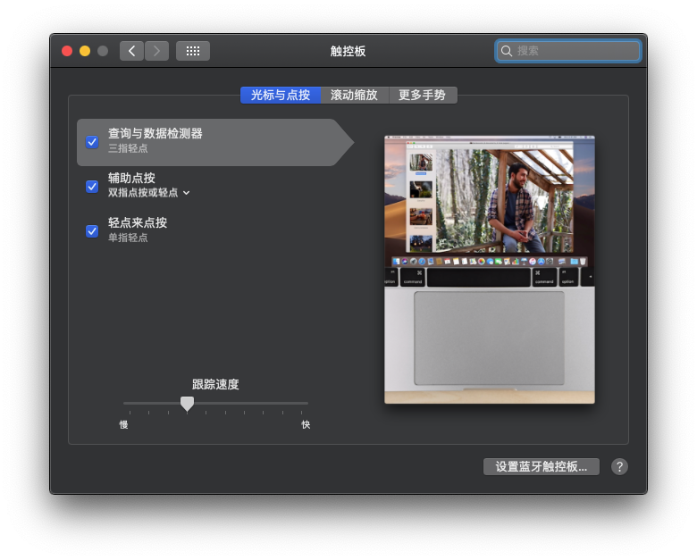

## 触控板

用 `ApplePS2SmartTouchPad.kext` 驱动触控板正常，`SSDT-FnKey.dsl` 可使用 `fn + F8/F9` 调整亮度。

但，问题是左边 `Shift + F1/F2` 也是调节亮度，感觉这个 shift 跟 fn 功能一样，不太方便

### 用法
 删除 `EFI/CLOVER/kexts/Other/VoodooPS2Controller.kext` 
 复制 `other/TouchPad/ApplePS2SmartTouchPad.kext` 到 `EFI/CLOVER/kexts/Other`
 
 如果要用 fn 调节亮度，还需复制编译后的 `other/TouchPad/SSDT-FnKey.dsl` 到 `EFI/CLOVER/ACPI/patched`

